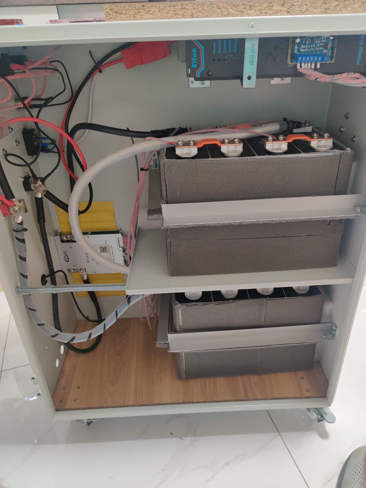
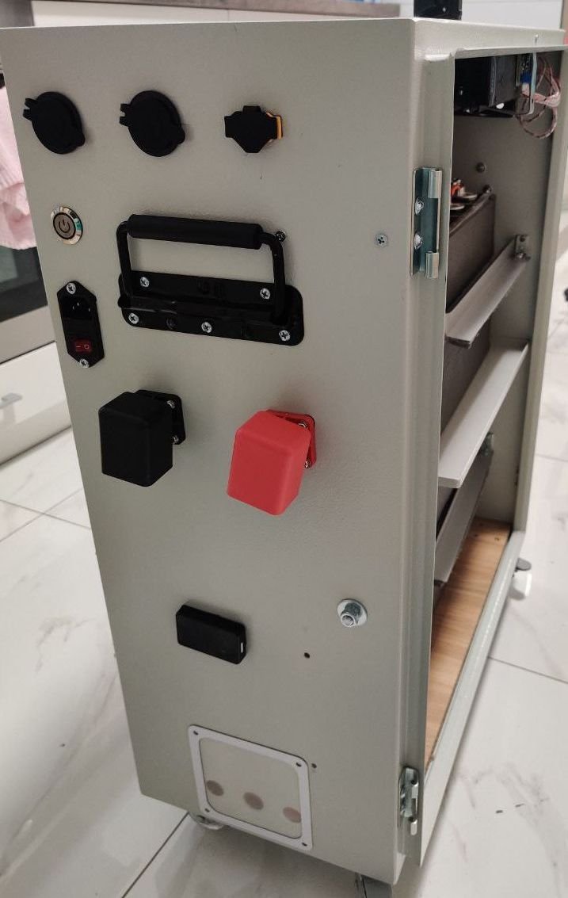
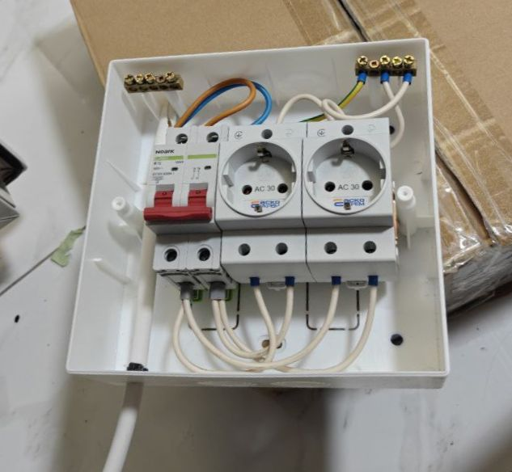
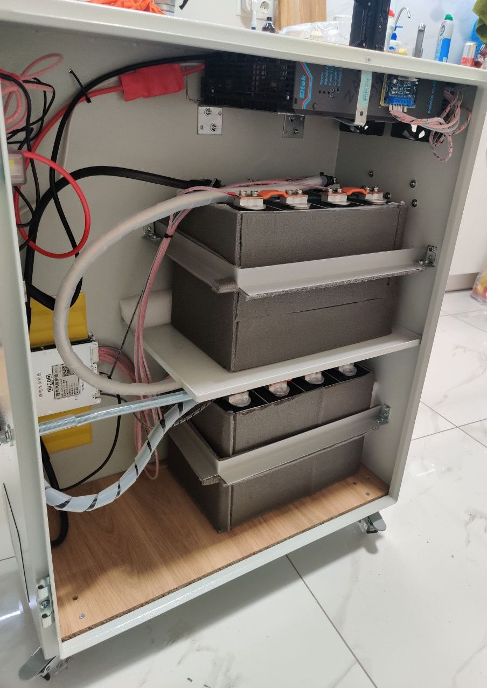
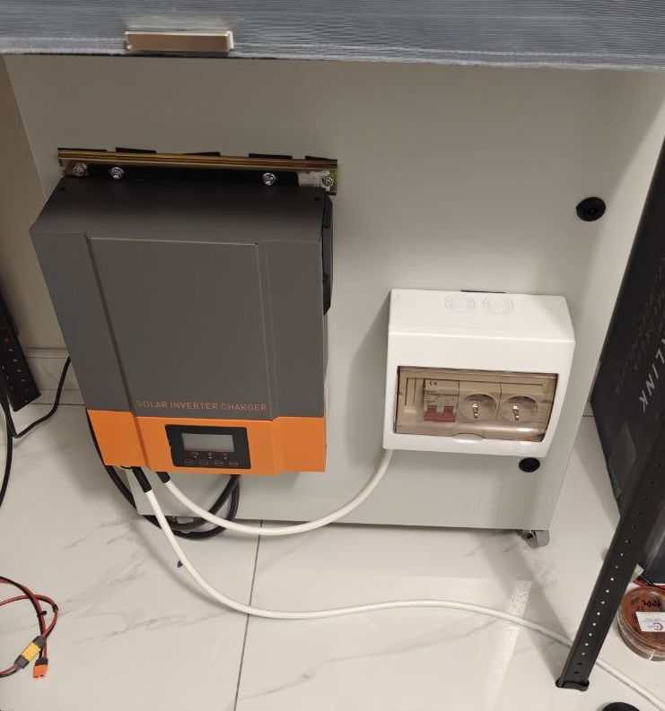

# Something around lifepo box:

## Box:

* JK BMS 200A 3S-8S 2A Lifepo4 Li-ion LTO JK-B2A8S20P
    * 3100,00 ₴ |17.05.2024
* 8 Cells [Eve LF280K v3 Prismatic 280Ah - LiFePO4](https://www.nkon.nl/ru/eve-lf280-prismatic-280ah-280a-lifepo4.html)
    * 303,60 € + 303,60 € | 23.04.2024
* Ізолятор для LiFePo4 EVE 230Ач 280Ач 304Ач склотекстолітовий лист 205мм х 173мм х 0.5мм
    * 800,00₴ | 17.05.2024
* Спіральна обв'язка для проводу
    * [Спіральна обв'язка для проводу ∅3-20 мм](https://001.com.ua/uk/spiralna-obvyazka-dlya-provodu-empty-3-20-mm-swb-03-bila-10-m-asko-ukrem)
    * [Спіральна обв'язка для проводу ∅15-100 мм SWB-19](https://001.com.ua/uk/spiralna-obvyazka-dlya-provodu-empty-15-100-mm-swb-19-bila-10-m-asko-ukrem)
* Електропровідна паста САВЕП “ЕлКонт-Н”
    * [link](https://k-energo.com.ua/product/elektroprovidna-pasta-savep-elkont-n-dlya-alyuminiyevyh-ta-midnyh-neruhomyh-kontaktiv/)
* ❗ Fuse (between 5\6 cells :facepalm:)  Запобіжник полосний MEGA 150А FG 150A
* Силовий кабель DC
    * [Провід установчий ПВ-3нгд 35 мм² гнучкий з мідними жилами](https://001.com.ua/uk/provid-ustanovchyy-pv-3ngd-35-mm2-gnuchkyy-z-midnymy-zhylamy-chornyy-yevropan)
    * ❗Накінечник АКБ зі сторони АКБ
        * [https://001.com.ua/uk/nakinechnyk-dt-g-35-midnyy-ludzhenyy-kabelnyy-pid-opresuvannya-asko-ukrem](https://001.com.ua/uk/nakinechnyk-dt-g-35-midnyy-ludzhenyy-kabelnyy-pid-opresuvannya-asko-ukrem)
    * ❗Накінечник АКБ зі сторони інветора
        * [Накінечник DT(FN)-35 мідний луджений кабельний під опресування](https://001.com.ua/uk/nakinechnyk-dt-fn-35-midnyy-ludzhenyy-kabelnyy-pid-opresuvannya-asko-ukrem)
* [Термозбіжна трубка на клейовій основі ТСК ∅25 мм чорна, АСКО-УКРЕМ](https://001.com.ua/uk/termozbizhna-trubka-na-kleyoviy-osnovi-tsk-empty-25-mm-chorna-asko-ukrem)
* ? [Накінечник SC-6-8 мідний луджений кабельний під пайку, АСКО-УКРЕМ](https://001.com.ua/uk/nakinechnyk-sc-6-8-midnyy-ludzhenyy-kabelnyy-pid-payku-asko-ukrem)
* ? [Накінечник SC-16-8 мідний луджений кабельний під пайку, АСКО-УКРЕМ](https://001.com.ua/uk/nakinechnyk-sc-16-8-midnyy-ludzhenyy-kabelnyy-pid-payku-asko-ukrem)
* На балансир(?)
    * [Накінечник SC-2,5-6 мідний луджений кабельний під пайку](https://001.com.ua/uk/nakinechnyk-sc-2-5-6-midnyy-ludzhenyy-kabelnyy-pid-payku-asko-ukrem)

## Powmr pow-hvm3.2H-24v

* Fan mod
    * [manko](https://diy.manko.pro/2024/10/22/powmr-silent-fans-mod/)
    * [youtube VM](https://www.youtube.com/watch?v=Q-VFa1Xtm-0&t=1s)

## Optional fuse box:

* [Модульний автоматичний вимикач Ex9BH 10kA хар-ка B 10A 2P, NOARK](https://001.com.ua/uk/modulnyy-avtomatychnyy-vymykach-ex9bh-10ka-har-ka-b-10a-2p-noark)
* [Корпус пластиковий 8-модульний e.plbox.stand.n.08k навісний, E.NEXT](https://001.com.ua/uk/korpus-plastykovyy-8-modulnyy-e-plbox-stand-n-08k-navisnyy-e-next)
* [Провід з'єднувальний ПВС 3×2,5 мм² гнучкий з мідними жилами, ЗЗКМ](https://001.com.ua/uk/provid-zyednuvalnyy-pvs-3x2-5-mm2-gnuchkyy-z-midnymy-zhylamy-zzkm)
* [Накінечник втулковий ізольований на 2 проводи 2×2.5 мм²](https://001.com.ua/uk/nakinechnyk-vtulkovyy-izolovanyy-na-2-provody-2x2-5-mm2-siryy-upakovka-100-sht-e-terminal-stand-te-2-2-5-grey-e-next)
* [Вилка 2P+PE 16А біла, Legrand](https://001.com.ua/uk/vylka-2p-pe-16a-bila-legrand)
* [Провід установчий ПВ-3нгд 2,5 мм² гнучкий з мідними жилами білий](https://001.com.ua/uk/provid-ustanovchyy-pv-3ngd-2-5-mm2-gnuchkyy-z-midnymy-zhylamy-bilyy-yevropan)

## Optional charger:

* [SMPS 1000 SI 24V](https://electroavtosam.com.ua/forums/viewtopic.php?t=3946)
* Идеальный диод 40V 60A - без клем

## Other:

* Скотч армований скловолокном прозорий 48мм х 50м

## Tools:

* [ Інструмент e.tool.cutter.lk.60.a.50 для різки кабелів перетином до 60 мм², E.NEXT ](https://001.com.ua/uk/instrument-e-tool-cutter-lk-60-a-50-dlya-rizky-kabeliv-peretynom-do-60-mm2-e-next)
* YR1035
* Цифрова динамометрична головка Shahe ANC-200 насадка на ключ 20-200 Нм
* Пресс
    * [Пара Матриць 8кв.мм Для Пресу гідравлічного ручного ПРГ-70 YQK-70](https://toolbox-kh.prom.ua/ua/p2273464985-para-matrits-8kvmm.html)
    * Прес ручний гідравлічний YQК-70 (4 до 70 мм²)

## Pics:

|                                                                                         |                                                                                               |
|-----------------------------------------------------------------------------------------|-----------------------------------------------------------------------------------------------|
| 
 internals_2
 | 
 internals_face
 |
| 
 fuse_box_2
   | 
 internals_3
       |
| 
 fuse_box_2
   |                                                                                               |

